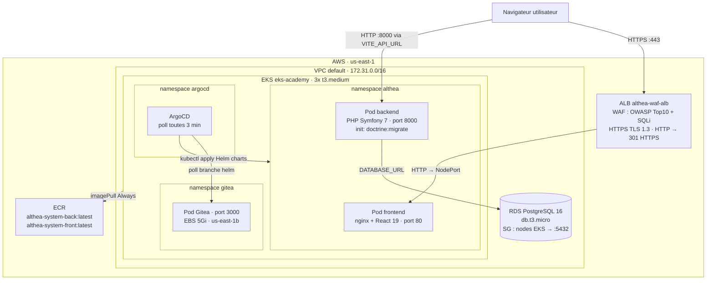
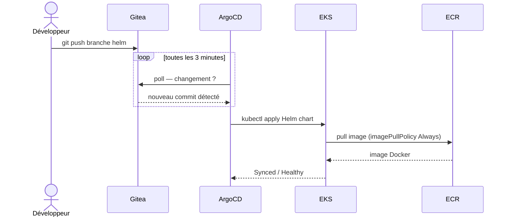
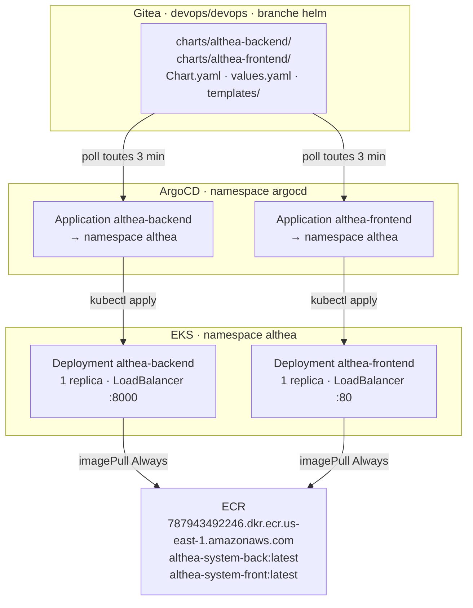
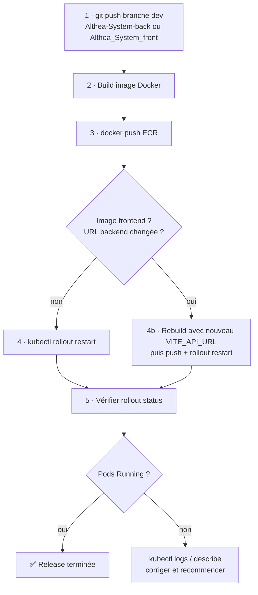
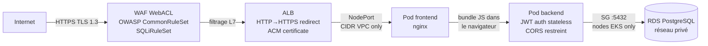
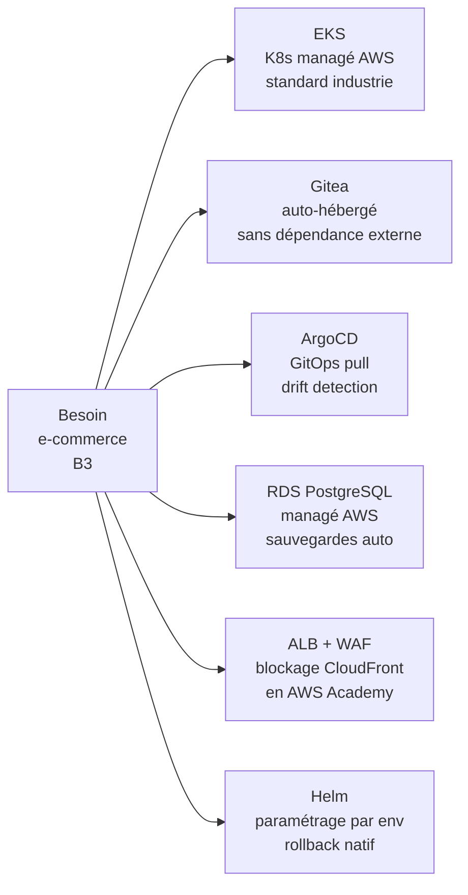
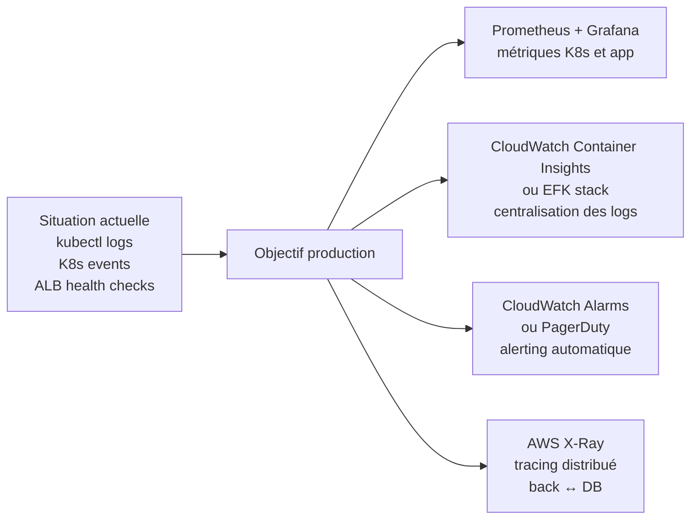

# Infrastructure Althea System — Guide de remise en service

Ce document permet à n'importe quel technicien de remonter l'infrastructure de zéro sur AWS Academy.

---

## Table des matières

1. [Vue d'ensemble](#1-vue-densemble)
2. [Prérequis](#2-prérequis)
3. [Contraintes AWS Academy](#3-contraintes-aws-academy)
4. [Configuration des credentials AWS](#4-configuration-des-credentials-aws)
5. [Déploiement EKS avec Terraform](#5-déploiement-eks-avec-terraform)
6. [Correctif IMDS hop limit](#6-correctif-imds-hop-limit)
7. [Configuration kubectl](#7-configuration-kubectl)
8. [EBS CSI Driver](#8-ebs-csi-driver)
9. [Déploiement Gitea](#9-déploiement-gitea)
10. [Configuration des dépôts Gitea](#10-configuration-des-dépôts-gitea)
11. [Déploiement ArgoCD](#11-déploiement-argocd)
12. [ECR — Dépôts d'images Docker](#12-ecr--dépôts-dimages-docker)
13. [Build et push des images Docker](#13-build-et-push-des-images-docker)
14. [Déploiement via ArgoCD](#14-déploiement-via-argocd)
15. [Utilisateurs Kubernetes](#15-utilisateurs-kubernetes)
16. [Architecture GitOps](#16-architecture-gitops)
17. [Gestion des coûts AWS Academy](#17-gestion-des-coûts-aws-academy)
18. [WAF + ALB + HTTPS](#18-waf--alb--https)
19. [Accès Gitea pour les développeurs](#19-accès-gitea-pour-les-développeurs)
20. [URLs et accès](#20-urls-et-accès)
21. [Renouveler les credentials AWS Academy](#21-renouveler-les-credentials-aws-academy)
22. [Troubleshooting](#22-troubleshooting)
23. [Annexe — Commandes utiles](#23-annexe--commandes-utiles)
24. [Base de données — RDS PostgreSQL](#24-base-de-données--rds-postgresql)
25. [Procédure de release complète](#25-procédure-de-release-complète)
26. [Sécurité — vue d'ensemble](#26-sécurité--vue-densemble)
27. [Choix techniques et justifications](#27-choix-techniques-et-justifications)
28. [Monitoring et observabilité](#28-monitoring-et-observabilité)

---

## 1. Vue d'ensemble

### Description fonctionnelle de l'application

Althea System est une plateforme e-commerce multi-langue (FR / EN / RU) composée de deux services indépendants.

**Backend — PHP Symfony 7** :
- API REST exposée sur `/api`
- Authentification stateless par JWT (Lexik JWT Bundle)
- Paiement en ligne via Stripe (checkout + webhooks)
- Base de données PostgreSQL 16 (AWS RDS)
- Migrations Doctrine gérées automatiquement au démarrage du pod (init container)

**Frontend — React 19 + Vite** :
- Pages : Home, Catalogue, Catégorie, Produit, Panier, Checkout, Compte, Recherche, Contact
- Appels API centralisés dans `Althea_System_front/src/services/api.js` (axios + intercepteur JWT)
- URL du backend (`VITE_API_URL`) baked dans le bundle JS au moment du build Docker

**Entités principales** : `User`, `Product`, `ProductTranslation`, `Category`, `CategoryTranslation`, `Items`, `Orders`, `Discount`, `ContactRequest`

---

### Schéma d'architecture complet



**Flux de données lors d'un appel API** :
1. Le navigateur charge la SPA React depuis le pod frontend (via ALB/WAF)
2. La SPA effectue ses appels REST directement vers le LoadBalancer backend (`VITE_API_URL`)
3. Le backend valide le JWT, interroge RDS, retourne la réponse JSON

---

### Stack technique

| Couche | Technologie |
|---|---|
| Cloud | AWS Academy (compte `787943492246`, région `us-east-1`) |
| Orchestration | EKS 1.31 (Kubernetes) |
| IaC | Terraform |
| GitOps | ArgoCD |
| Registry Git | Gitea |
| Registry Docker | Amazon ECR |
| Backend | PHP Symfony 7 (ELB port 8000) |
| Frontend | React 19 + Vite (ELB port 80) |
| Packaging K8s | Helm |

### Node groups EKS

| Node group | AZ | Rôle | Taille |
|---|---|---|---|
| `eks-academy-nodes` | us-east-1a/b/c/d/f | Workloads généraux (ArgoCD, app) | 2x t3.medium |
| `gitea-node-1b` | us-east-1b uniquement | Gitea (volume EBS en us-east-1b) | 1x t3.medium |

> **Pourquoi deux node groups ?** Le volume EBS de Gitea est créé en `us-east-1b`. Un volume EBS ne peut être monté que sur un node dans la même AZ. Le node group `gitea-node-1b` garantit qu'un node est toujours disponible dans cette AZ.

### Structure du projet

```
~/eks_deploy/
├── terraform/                  # Code IaC : cluster EKS, node groups
│   ├── main.tf / vpc.tf / eks.tf / variables.tf / outputs.tf
│   └── terraform.tfvars
├── charts/                     # Helm charts (pushés sur la branche helm de Gitea)
│   ├── althea-backend/         # Chart backend PHP Symfony
│   └── althea-frontend/        # Chart frontend React
├── kubernetes/                 # Manifests et scripts kubectl
│   ├── gitea.yaml              # Manifest Gitea (Namespace + PVC + Deployment + Service)
│   ├── deploy-argocd.sh        # Installation ArgoCD + connexion Gitea (one-shot)
│   └── update-argocd-repo.sh   # Mise à jour ArgoCD quand l'URL Gitea change
├── aws_waf/                    # WAF + ALB + HTTPS
│   └── aws_deploy.sh           # Script de déploiement WAF (idempotent)
├── Althea-System-back/         # Code source backend PHP Symfony
├── Althea_System_front/        # Code source frontend React + Vite
├── kubeconfig-devops.yaml      # Kubeconfig utilisateur devops (cluster-admin)
├── kubeconfig-developer.yaml   # Kubeconfig utilisateur developer (namespace althea)
└── INFRASTRUCTURE.md           # Ce document
```

### Schéma de flux GitOps



---

## 2. Prérequis

Installer les outils suivants sur la machine locale :

```bash
# Terraform >= 1.5
wget https://releases.hashicorp.com/terraform/1.9.0/terraform_1.9.0_linux_amd64.zip
unzip terraform_1.9.0_linux_amd64.zip && sudo mv terraform /usr/local/bin/

# kubectl
curl -LO "https://dl.k8s.io/release/$(curl -L -s https://dl.k8s.io/release/stable.txt)/bin/linux/amd64/kubectl"
chmod +x kubectl && sudo mv kubectl /usr/local/bin/

# AWS CLI v2
curl "https://awscli.amazonaws.com/awscli-exe-linux-x86_64.zip" -o "awscliv2.zip"
unzip awscliv2.zip && sudo ./aws/install

# Helm
curl https://raw.githubusercontent.com/helm/helm/main/scripts/get-helm-3 | bash

# Docker
sudo apt-get install -y docker.io
sudo usermod -aG docker $USER  # reconnexion requise

# ArgoCD CLI (installé dans ~/ car /usr/local/bin peut nécessiter sudo)
curl -sSL -o ~/argocd https://github.com/argoproj/argo-cd/releases/latest/download/argocd-linux-amd64
chmod +x ~/argocd
```

---

## 3. Contraintes AWS Academy

AWS Academy impose des restrictions importantes par rapport à un compte AWS standard. **Ne pas essayer de contourner ces restrictions** — elles sont permanentes.

| Action bloquée | Raison | Solution appliquée |
|---|---|---|
| `iam:CreateRole` | Pas de création de rôles IAM | Utiliser le rôle `LabRole` pré-existant |
| `iam:CreateOpenIDConnectProvider` | Pas d'OIDC provider | Addon EBS CSI sans IRSA (utilise le node instance profile) |
| `ec2:ImportKeyPair` | Pas de keypair SSH | Pas de `remote_access` sur les nodes |
| `ec2:CreateVpc` | Pas de création de VPC | Utiliser le VPC default pré-existant |
| `sts:AssumeRole` sur LabRole | Pas d'assume_role | Pas de bloc `assume_role` dans le provider Terraform |
| Credentials temporaires ASIA | Session token requis | Ajouter `aws_session_token` dans `~/.aws/credentials` |
| EKS dans us-east-1e | AZ non supportée pour EKS | Filtrer les subnets pour exclure `us-east-1e` |
| `eks:UpdateNodegroupConfig` | Bloqué par `voc-cancel-cred` | Requiert une session active (credentials valides) |

---

## 4. Configuration des credentials AWS

Les credentials AWS Academy expirent toutes les 4 heures. À chaque nouvelle session :

1. Aller sur le portail AWS Academy
2. Cliquer sur **Start Lab** et attendre que le point soit vert
3. Cliquer sur **AWS Details** → **Show** à côté d'*AWS CLI*
4. Copier les 3 valeurs dans `~/.aws/credentials` :

```ini
[default]
aws_access_key_id = ASIA...
aws_secret_access_key = ...
aws_session_token = ...
region = us-east-1
```

> **Important** : Les credentials commencent toujours par `ASIA` (temporaires). Sans `aws_session_token`, toutes les commandes AWS échouent avec `InvalidClientTokenId`.

> **Important** : Quand la session expire, la politique `voc-cancel-cred` bloque toutes les opérations AWS — même `eks:UpdateNodegroupConfig`. Il faut obligatoirement démarrer une nouvelle session avant toute commande AWS.

Vérifier que les credentials fonctionnent :

```bash
aws sts get-caller-identity
# Doit afficher : Account: 787943492246, Arn: arn:aws:sts::787943492246:assumed-role/LabRole/...
```

---

## 5. Déploiement EKS avec Terraform

Le code Terraform se trouve dans `terraform/` (à la racine du projet `~/eks_deploy`).

### Structure des fichiers

```
terraform/
├── main.tf          # Provider AWS, data account
├── vpc.tf           # Data source VPC default + subnets (us-east-1a/b/c/d/f)
├── eks.tf           # Cluster EKS + node group + security groups
├── variables.tf     # Déclaration des variables
├── outputs.tf       # Outputs (cluster endpoint, etc.)
└── terraform.tfvars # Valeurs des variables
```

### Valeurs clés dans `terraform.tfvars`

```hcl
region             = "us-east-1"
account_id         = "787943492246"
cluster_name       = "eks-academy"
cluster_version    = "1.31"
node_instance_type = "t3.medium"
node_desired_size  = 2
node_min_size      = 1
node_max_size      = 3
```

### Points critiques dans le code Terraform

- **Rôle IAM** : `data "aws_iam_role" "lab_role" { name = "LabRole" }` — utilisé pour le cluster ET les nodes
- **VPC** : `data "aws_vpc" "default" { default = true }` — pas de création de VPC
- **Subnets** : filtrés sur les AZ `us-east-1a/b/c/d/f` (jamais `us-east-1e` — EKS ne le supporte pas)
- **Pas de `remote_access`** sur le node group — ec2:ImportKeyPair est bloqué
- **Pas d'`assume_role`** dans le provider — sts:AssumeRole sur LabRole est bloqué

### Déploiement

```bash
cd ~/eks_deploy/terraform

terraform init
terraform plan    # Vérifier qu'il n'y a pas d'erreur de permissions
terraform apply   # ~15 minutes pour le cluster EKS
```

### Node group dédié pour Gitea (après terraform apply)

Ce node group doit être créé manuellement car il cible une AZ spécifique non gérable via le Terraform existant :

```bash
aws eks create-nodegroup \
  --cluster-name eks-academy \
  --nodegroup-name gitea-node-1b \
  --node-role $(aws iam get-role --role-name LabRole --query 'Role.Arn' --output text) \
  --subnets subnet-0b8c4bba3bb7fdbba \
  --instance-types t3.medium \
  --scaling-config minSize=1,maxSize=1,desiredSize=1 \
  --region us-east-1

# Attendre qu'il soit actif (~4 min)
aws eks wait nodegroup-active \
  --cluster-name eks-academy \
  --nodegroup-name gitea-node-1b \
  --region us-east-1
```

> Le subnet `subnet-0b8c4bba3bb7fdbba` est le subnet du VPC default en `us-east-1b`. Vérifier avec : `aws ec2 describe-subnets --filters "Name=availabilityZone,Values=us-east-1b" --query "Subnets[?DefaultForAz==\`true\`].SubnetId" --output text --region us-east-1`

---

## 6. Correctif IMDS hop limit

**Ce correctif est obligatoire** et doit être appliqué **à chaque fois que des nodes sont créés ou recréés** (après un scale-up, après une nouvelle session, etc.).

Sans ce correctif, les pods qui ont besoin des credentials AWS via IMDS (Instance Metadata Service) — notamment le driver EBS CSI — restent en `CrashLoopBackOff`.

Par défaut, les instances EC2 EKS ont un IMDS hop limit de 1, ce qui empêche les pods de traverser la couche réseau du container pour atteindre le service de métadonnées.

### Appliquer sur tous les nodes

```bash
for ID in $(aws ec2 describe-instances \
  --filters "Name=tag:eks:cluster-name,Values=eks-academy" \
            "Name=instance-state-name,Values=running" \
  --query "Reservations[].Instances[].InstanceId" \
  --output text --region us-east-1); do
  echo -n "Fixing $ID ... "
  aws ec2 modify-instance-metadata-options \
    --instance-id $ID \
    --http-put-response-hop-limit 2 \
    --http-endpoint enabled \
    --region us-east-1 \
    --query 'InstanceMetadataOptions.HttpPutResponseHopLimit' \
    --output text
done
```

### Vérifier que le driver EBS CSI est opérationnel

```bash
kubectl get pods -n kube-system | grep ebs-csi
# Tous les pods doivent être en Running (pas CrashLoopBackOff)
```

> **Symptôme si non appliqué** : `ebs-csi-controller` en `CrashLoopBackOff` → les PVC ne peuvent pas être montés → les pods qui en dépendent (ex: Gitea) restent en `ContainerCreating` avec `FailedAttachVolume`.

---

## 7. Configuration kubectl

```bash
aws eks update-kubeconfig \
  --region us-east-1 \
  --name eks-academy

# Vérifier la connexion (doit afficher 3 nodes : 2 généraux + 1 Gitea)
kubectl get nodes -L topology.kubernetes.io/zone
```

> **Note** : Le kubeconfig utilise les credentials AWS de `~/.aws/credentials`. À chaque renouvellement de session, kubectl refonctionne automatiquement sans manipulation supplémentaire.

---

## 8. EBS CSI Driver

Nécessaire pour que les PersistentVolumeClaims fonctionnent sur EKS.

```bash
# Installer l'addon EBS CSI (sans rôle IRSA — non disponible en AWS Academy)
aws eks create-addon \
  --cluster-name eks-academy \
  --addon-name aws-ebs-csi-driver \
  --region us-east-1

# Attendre que l'addon soit actif (~2 min)
aws eks wait addon-active \
  --cluster-name eks-academy \
  --addon-name aws-ebs-csi-driver \
  --region us-east-1

# Appliquer ensuite le correctif IMDS (section 6)
```

---

## 9. Déploiement Gitea

Gitea est déployé via des manifests kubectl (pas Helm) pour avoir un contrôle précis sur le PVC.

### Déployer Gitea

```bash
kubectl create namespace gitea

kubectl apply -f - <<'EOF'
apiVersion: apps/v1
kind: Deployment
metadata:
  name: gitea
  namespace: gitea
spec:
  replicas: 1
  selector:
    matchLabels:
      app: gitea
  template:
    metadata:
      labels:
        app: gitea
    spec:
      containers:
        - name: gitea
          image: gitea/gitea:latest
          ports:
            - containerPort: 3000
            - containerPort: 22
          env:
            - name: GITEA__server__ROOT_URL
              value: "http://GITEA_LB_URL"   # Remplacer après création du service
            - name: GITEA__server__HTTP_PORT
              value: "3000"
          volumeMounts:
            - name: data
              mountPath: /data
      volumes:
        - name: data
          persistentVolumeClaim:
            claimName: gitea-data
---
apiVersion: v1
kind: PersistentVolumeClaim
metadata:
  name: gitea-data
  namespace: gitea
spec:
  accessModes:
    - ReadWriteOnce
  resources:
    requests:
      storage: 5Gi
  storageClassName: gp2
---
apiVersion: v1
kind: Service
metadata:
  name: gitea
  namespace: gitea
spec:
  type: LoadBalancer
  selector:
    app: gitea
  ports:
    - name: http
      port: 80
      targetPort: 3000
    - name: ssh
      port: 22
      targetPort: 22
EOF

# Attendre le LoadBalancer (~2 min)
kubectl get svc gitea -n gitea -w
```

### Récupérer l'URL et configurer l'admin

```bash
GITEA_URL="http://$(kubectl get svc gitea -n gitea -o jsonpath='{.status.loadBalancer.ingress[0].hostname}')"
echo "Gitea URL: $GITEA_URL"

# Créer le compte admin via l'API
curl -s -X POST "$GITEA_URL/api/v1/users/search" | head -5
# Si Gitea répond, aller sur $GITEA_URL et compléter l'installation initiale
# Login admin : devops / A3oVu73FEqsgwW5TPgX2r6fw9HOM
```

> **Note** : Le pod Gitea doit scheduler sur le node `us-east-1b` (node group `gitea-node-1b`) car le volume EBS est dans cette AZ. Si le pod reste en `Pending` avec `FailedAttachVolume`, vérifier le correctif IMDS (section 6).

---

## 10. Configuration des dépôts Gitea

### Dépôts à créer

| Repo | Branches |
|---|---|
| `devops/devops` | `main`, `helm`, `ansible`, `terraform` |
| `devops/althea-system-back` | `main`, `dev`, `pre-prod`, `prod` |
| `devops/althea-system-front` | `main`, `dev`, `pre-prod`, `prod` |

```bash
GITEA_URL="http://$(kubectl get svc gitea -n gitea -o jsonpath='{.status.loadBalancer.ingress[0].hostname}')"
GITEA_USER="devops"
GITEA_PASS="A3oVu73FEqsgwW5TPgX2r6fw9HOM"

for REPO in devops althea-system-back althea-system-front; do
  curl -s -X POST "$GITEA_URL/api/v1/user/repos" \
    -u "$GITEA_USER:$GITEA_PASS" \
    -H "Content-Type: application/json" \
    -d "{\"name\":\"$REPO\",\"private\":false,\"auto_init\":false}"
  echo "Repo $REPO créé"
done
```

### Push du code dans les dépôts

```bash
GITEA_URL="http://$(kubectl get svc gitea -n gitea -o jsonpath='{.status.loadBalancer.ingress[0].hostname}')"

# Repo devops — branche helm (Helm charts) + branche terraform
cd ~/eks_deploy
git remote set-url origin "http://devops:A3oVu73FEqsgwW5TPgX2r6fw9HOM@${GITEA_URL#http://}/devops/devops.git"
git checkout -b helm
git add charts/ && git commit -m "feat: helm charts"
git push -u origin helm
git checkout -b terraform
git add terraform/ && git commit -m "feat: terraform EKS"
git push -u origin terraform

# Backend
cd ~/eks_deploy/Althea-System-back
git remote set-url origin "http://devops:A3oVu73FEqsgwW5TPgX2r6fw9HOM@${GITEA_URL#http://}/devops/althea-system-back.git" 2>/dev/null || \
  git remote add origin "http://devops:A3oVu73FEqsgwW5TPgX2r6fw9HOM@${GITEA_URL#http://}/devops/althea-system-back.git"
git push origin master:main master:dev master:pre-prod master:prod

# Frontend
cd ~/eks_deploy/Althea_System_front
git remote set-url origin "http://devops:A3oVu73FEqsgwW5TPgX2r6fw9HOM@${GITEA_URL#http://}/devops/althea-system-front.git" 2>/dev/null || \
  git remote add origin "http://devops:A3oVu73FEqsgwW5TPgX2r6fw9HOM@${GITEA_URL#http://}/devops/althea-system-front.git"
git push origin master:main master:dev master:pre-prod master:prod
```

> **Attention** : Après chaque recréation du service Gitea (LoadBalancer), l'URL change. Mettre à jour les remotes git ET les applications ArgoCD (voir section 14).

---

## 11. Déploiement ArgoCD

> **Script automatisé** : `kubernetes/deploy-argocd.sh` effectue toutes les étapes ci-dessous en une seule commande (installation → LoadBalancer → CLI → connexion Gitea → création des apps → sync).
> ```bash
> cd ~/eks_deploy
> chmod +x kubernetes/deploy-argocd.sh
> ./kubernetes/deploy-argocd.sh
> ```

Les étapes manuelles équivalentes sont détaillées ci-dessous.

```bash
kubectl create namespace argocd
kubectl apply -n argocd -f \
  https://raw.githubusercontent.com/argoproj/argo-cd/stable/manifests/install.yaml

# Attendre que tous les pods soient Running (~3 min)
kubectl wait --for=condition=available --timeout=300s \
  deployment/argocd-server -n argocd

# Exposer ArgoCD via LoadBalancer
kubectl patch svc argocd-server -n argocd \
  -p '{"spec": {"type": "LoadBalancer"}}'

kubectl get svc argocd-server -n argocd -w
```

### Récupérer le mot de passe admin

```bash
kubectl get secret argocd-initial-admin-secret -n argocd \
  -o jsonpath="{.data.password}" | base64 -d && echo
```

Login : `admin` / `<mot de passe ci-dessus>`

### Connecter ArgoCD à Gitea

```bash
ARGOCD_URL=$(kubectl get svc argocd-server -n argocd -o jsonpath='{.status.loadBalancer.ingress[0].hostname}')
ARGOCD_PASS=$(kubectl get secret argocd-initial-admin-secret -n argocd -o jsonpath="{.data.password}" | base64 -d)
GITEA_URL="http://$(kubectl get svc gitea -n gitea -o jsonpath='{.status.loadBalancer.ingress[0].hostname}')"

~/argocd login $ARGOCD_URL --username admin --password $ARGOCD_PASS --insecure

~/argocd repo add $GITEA_URL/devops/devops.git \
  --username devops \
  --password A3oVu73FEqsgwW5TPgX2r6fw9HOM \
  --insecure-skip-server-verification
```

---

## 12. ECR — Dépôts d'images Docker

```bash
ACCOUNT_ID="787943492246"
REGION="us-east-1"

aws ecr create-repository --repository-name althea-system-back --region $REGION
aws ecr create-repository --repository-name althea-system-front --region $REGION

# Login Docker ECR (valable 12h, à refaire après renouvellement de session)
aws ecr get-login-password --region $REGION | \
  docker login --username AWS \
  --password-stdin $ACCOUNT_ID.dkr.ecr.$REGION.amazonaws.com
```

---

## 13. Build et push des images Docker

### Backend (PHP Symfony)

Dockerfile : `Althea-System-back/docker/php/Dockerfile`

**Points critiques** :
- `COPY . .` copie le code source avant `composer install` — le projet ne tourne pas en volume monté
- Ne pas utiliser `--no-dev` : `bundles.php` charge MakerBundle même en mode prod
- `config/packages/doctrine.yaml` : `server_version: '16'` doit être décommenté sinon Doctrine tente de se connecter à la DB au démarrage pour détecter la version et plante

```bash
ACCOUNT_ID="787943492246"
REGION="us-east-1"
BACKEND_IMAGE="$ACCOUNT_ID.dkr.ecr.$REGION.amazonaws.com/althea-system-back"

cd ~/eks_deploy/Althea-System-back
docker build -f docker/php/Dockerfile -t $BACKEND_IMAGE:latest .
docker push $BACKEND_IMAGE:latest
```

### Frontend (React + Vite)

Dockerfile : `Althea_System_front/Dockerfile`

**Point critique** : `VITE_API_URL` est baked dans le bundle JS au moment du build — ce n'est PAS une variable d'environnement runtime. Si l'URL du backend change (ex: nouveau LoadBalancer), il faut **rebuilder et repusher l'image**.

```bash
ACCOUNT_ID="787943492246"
REGION="us-east-1"
FRONTEND_IMAGE="$ACCOUNT_ID.dkr.ecr.$REGION.amazonaws.com/althea-system-front"
BACKEND_LB="http://$(kubectl get svc althea-backend-althea-backend -n althea \
  -o jsonpath='{.status.loadBalancer.ingress[0].hostname}'):8000/api"

cd ~/eks_deploy/Althea_System_front
docker build --build-arg VITE_API_URL=$BACKEND_LB -t $FRONTEND_IMAGE:latest .
docker push $FRONTEND_IMAGE:latest
```

---

## 14. Déploiement via ArgoCD

### Créer les applications ArgoCD

```bash
GITEA_URL="http://$(kubectl get svc gitea -n gitea -o jsonpath='{.status.loadBalancer.ingress[0].hostname}')"
ACCOUNT_ID="787943492246"
REGION="us-east-1"

~/argocd app create althea-backend \
  --repo $GITEA_URL/devops/devops.git \
  --revision helm \
  --path charts/althea-backend \
  --dest-server https://kubernetes.default.svc \
  --dest-namespace althea \
  --sync-policy automated \
  --auto-prune \
  --self-heal \
  --helm-set image.repository=$ACCOUNT_ID.dkr.ecr.$REGION.amazonaws.com/althea-system-back \
  --helm-set image.tag=latest \
  --helm-set migrations.enabled=false \
  --sync-option CreateNamespace=true

~/argocd app create althea-frontend \
  --repo $GITEA_URL/devops/devops.git \
  --revision helm \
  --path charts/althea-frontend \
  --dest-server https://kubernetes.default.svc \
  --dest-namespace althea \
  --sync-policy automated \
  --auto-prune \
  --self-heal \
  --helm-set image.repository=$ACCOUNT_ID.dkr.ecr.$REGION.amazonaws.com/althea-system-front \
  --helm-set image.tag=latest \
  --sync-option CreateNamespace=true

~/argocd app sync althea-backend
~/argocd app sync althea-frontend
```

### Mettre à jour l'URL Gitea dans ArgoCD

Si le service Gitea est recréé (nouvelle URL LoadBalancer), utiliser le script dédié :

```bash
cd ~/eks_deploy
./kubernetes/update-argocd-repo.sh
```

Ou manuellement :

```bash
GITEA_NEW="http://$(kubectl get svc gitea -n gitea -o jsonpath='{.status.loadBalancer.ingress[0].hostname}')"

~/argocd repo add $GITEA_NEW/devops/devops.git \
  --username devops \
  --password A3oVu73FEqsgwW5TPgX2r6fw9HOM \
  --insecure-skip-server-verification

~/argocd app set althea-backend --repo $GITEA_NEW/devops/devops.git
~/argocd app set althea-frontend --repo $GITEA_NEW/devops/devops.git

~/argocd app sync althea-backend
~/argocd app sync althea-frontend
```

### Forcer un re-déploiement après push d'image

ArgoCD ne détecte pas les nouvelles images avec le même tag `latest`. Pour forcer le redéploiement :

```bash
kubectl rollout restart deployment/althea-backend-althea-backend -n althea
kubectl rollout restart deployment/althea-frontend-althea-frontend -n althea

kubectl rollout status deployment/althea-backend-althea-backend -n althea
kubectl rollout status deployment/althea-frontend-althea-frontend -n althea
```

---

## 15. Utilisateurs Kubernetes

Deux utilisateurs K8s sont configurés avec des kubeconfig dédiés.

| Utilisateur | Permissions | Fichier kubeconfig |
|---|---|---|
| `devops` | `cluster-admin` — accès complet au cluster | `kubeconfig-devops.yaml` |
| `developer` | Lecture + restart des deployments dans `althea` uniquement | `kubeconfig-developer.yaml` |

Les kubeconfigs sont dans `~/eks_deploy/`.

### Recréer les utilisateurs (si cluster recréé)

```bash
kubectl apply -f - <<'EOF'
apiVersion: v1
kind: ServiceAccount
metadata:
  name: devops
  namespace: kube-system
---
apiVersion: v1
kind: Secret
metadata:
  name: devops-token
  namespace: kube-system
  annotations:
    kubernetes.io/service-account.name: devops
type: kubernetes.io/service-account-token
---
apiVersion: rbac.authorization.k8s.io/v1
kind: ClusterRoleBinding
metadata:
  name: devops-cluster-admin
subjects:
  - kind: ServiceAccount
    name: devops
    namespace: kube-system
roleRef:
  kind: ClusterRole
  name: cluster-admin
  apiGroup: rbac.authorization.k8s.io
---
apiVersion: v1
kind: ServiceAccount
metadata:
  name: developer
  namespace: althea
---
apiVersion: v1
kind: Secret
metadata:
  name: developer-token
  namespace: althea
  annotations:
    kubernetes.io/service-account.name: developer
type: kubernetes.io/service-account-token
---
apiVersion: rbac.authorization.k8s.io/v1
kind: Role
metadata:
  name: developer-role
  namespace: althea
rules:
  - apiGroups: ["", "apps", "batch"]
    resources: ["pods", "pods/log", "deployments", "services", "replicasets", "configmaps", "events"]
    verbs: ["get", "list", "watch"]
  - apiGroups: ["apps"]
    resources: ["deployments"]
    verbs: ["patch", "update"]
---
apiVersion: rbac.authorization.k8s.io/v1
kind: RoleBinding
metadata:
  name: developer-role-binding
  namespace: althea
subjects:
  - kind: ServiceAccount
    name: developer
    namespace: althea
roleRef:
  kind: Role
  name: developer-role
  apiGroup: rbac.authorization.k8s.io
EOF

# Générer les kubeconfigs
CLUSTER_SERVER=$(kubectl config view --minify -o jsonpath='{.clusters[0].cluster.server}')
CLUSTER_CA=$(kubectl get secret devops-token -n kube-system -o jsonpath='{.data.ca\.crt}')
DEVOPS_TOKEN=$(kubectl get secret devops-token -n kube-system -o jsonpath='{.data.token}' | base64 -d)
DEV_TOKEN=$(kubectl get secret developer-token -n althea -o jsonpath='{.data.token}' | base64 -d)

# kubeconfig devops
cat > ~/eks_deploy/kubeconfig-devops.yaml <<YAML
apiVersion: v1
kind: Config
clusters:
- cluster:
    certificate-authority-data: ${CLUSTER_CA}
    server: ${CLUSTER_SERVER}
  name: eks-academy
contexts:
- context:
    cluster: eks-academy
    user: devops
  name: devops@eks-academy
current-context: devops@eks-academy
users:
- name: devops
  user:
    token: ${DEVOPS_TOKEN}
YAML

# kubeconfig developer
cat > ~/eks_deploy/kubeconfig-developer.yaml <<YAML
apiVersion: v1
kind: Config
clusters:
- cluster:
    certificate-authority-data: ${CLUSTER_CA}
    server: ${CLUSTER_SERVER}
  name: eks-academy
contexts:
- context:
    cluster: eks-academy
    user: developer
    namespace: althea
  name: developer@eks-academy
current-context: developer@eks-academy
users:
- name: developer
  user:
    token: ${DEV_TOKEN}
YAML
```

### Utiliser un kubeconfig

```bash
# Option 1 : variable d'environnement
export KUBECONFIG=~/eks_deploy/kubeconfig-devops.yaml
kubectl get nodes

# Option 2 : flag direct
kubectl --kubeconfig kubeconfig-developer.yaml get pods -n althea
```

---

## 16. Architecture GitOps



---

## 17. Gestion des coûts AWS Academy

Budget total : **$50**. Coût estimé avec l'infra complète active :

| Ressource | Coût/heure | Coût/jour |
|---|---|---|
| EKS control plane | $0.10 | $2.40 |
| 2x t3.medium (workloads) | $0.083 | $2.00 |
| 1x t3.medium (Gitea) | $0.042 | $1.00 |
| ~5 Load Balancers | $0.040 | $0.96 |
| **Total** | **~$0.27** | **~$6.40** |

### Réduire les coûts sans supprimer le cluster

Scaler les nodes à 0 arrête les EC2 (plus gros poste de coût) tout en conservant le cluster et les données.

```bash
# Éteindre les nodes workloads (garde le node Gitea pour préserver les données)
aws eks update-nodegroup-config \
  --cluster-name eks-academy \
  --nodegroup-name eks-academy-nodes \
  --scaling-config minSize=0,maxSize=3,desiredSize=0 \
  --region us-east-1

# Vérifier
aws eks describe-nodegroup \
  --cluster-name eks-academy \
  --nodegroup-name eks-academy-nodes \
  --region us-east-1 \
  --query 'nodegroup.scalingConfig'
```

### Relancer les nodes

```bash
aws eks update-nodegroup-config \
  --cluster-name eks-academy \
  --nodegroup-name eks-academy-nodes \
  --scaling-config minSize=1,maxSize=3,desiredSize=2 \
  --region us-east-1

# Après le scale-up, OBLIGATOIRE : appliquer le correctif IMDS sur les nouveaux nodes (section 6)
# puis vérifier que les pods ArgoCD et althea redémarrent correctement
```

> **Attention** : La commande `eks:UpdateNodegroupConfig` est bloquée par la politique `voc-cancel-cred` quand la session est expirée. Il faut d'abord renouveler les credentials (section 21).

---

## 18. WAF + ALB + HTTPS

Le frontend est protégé par AWS WAF via un ALB dédié. Le script de déploiement se trouve dans `aws_waf/aws_deploy.sh`.

### Architecture

```
Internet → ALB (WAF) :443 HTTPS / :80 redirect → NodePort K8s → Pod frontend
```

### Déployer ou recréer le WAF

```bash
cd ~/eks_deploy/aws_waf
chmod +x aws_deploy.sh
./aws_deploy.sh
```

Le script est idempotent — il saute les ressources déjà existantes.

### Ressources créées

| Ressource AWS | Nom | Détail |
|---|---|---|
| WAF WebACL | `althea-waf-regional` | CommonRuleSet + SQLiRuleSet (OWASP + SQLi) |
| ALB | `althea-waf-alb` | internet-facing, us-east-1 |
| Target Group | `althea-frontend-tg` | instance type, NodePort frontend |
| Certificat ACM | `althea.local` | auto-signé 2 ans, importé dans ACM |
| SG ALB | `althea-alb-sg` | 0.0.0.0/0 → :80 et :443 |

### Listeners

| Port | Protocole | Action |
|---|---|---|
| 80 | HTTP | Redirect 301 → HTTPS:443 |
| 443 | HTTPS TLS 1.3 | Forward → Target Group |

### Accès

| | URL |
|---|---|
| **HTTPS (WAF)** | `https://althea-waf-alb-665176235.us-east-1.elb.amazonaws.com` |
| **HTTP** | redirige automatiquement vers HTTPS |

> **Avertissement navigateur** : Le certificat est auto-signé pour `althea.local`. Cliquer "Avancer quand même". Pour supprimer l'avertissement, il faut un vrai domaine + certificat ACM public.

### Passer à un vrai certificat

```bash
# 1. Créer le certificat ACM (validation DNS)
aws acm request-certificate \
  --domain-name votre-domaine.com \
  --validation-method DNS \
  --region us-east-1

# 2. Ajouter le CNAME de validation dans votre DNS, puis attendre la validation

# 3. Remplacer le certificat sur le listener 443
LISTENER_ARN=$(aws elbv2 describe-listeners \
  --load-balancer-arn $(aws elbv2 describe-load-balancers \
    --names althea-waf-alb --query 'LoadBalancers[0].LoadBalancerArn' --output text --region us-east-1) \
  --query 'Listeners[?Port==`443`].ListenerArn' --output text --region us-east-1)

aws elbv2 modify-listener \
  --listener-arn $LISTENER_ARN \
  --certificates CertificateArn=<NEW_CERT_ARN> \
  --region us-east-1
```

### Après un scale-up des nodes

Le NodePort du frontend peut changer après un redéploiement. Si le WAF ne répond plus :

```bash
# Récupérer le nouveau NodePort
NEW_PORT=$(kubectl get svc althea-frontend-althea-frontend -n althea \
  -o jsonpath='{.spec.ports[0].nodePort}')

# Mettre à jour le Target Group
TG_ARN=$(aws elbv2 describe-target-groups --names althea-frontend-tg \
  --query 'TargetGroups[0].TargetGroupArn' --output text --region us-east-1)

# Dé-enregistrer les anciens targets et ré-enregistrer avec le nouveau port
# (relancer ./aws_deploy.sh est plus simple)
./aws_waf/aws_deploy.sh
```

---

## 19. Accès Gitea pour les développeurs

### Comptes Gitea

| Compte | Rôle | Accès |
|---|---|---|
| `devops` | Admin | Tous les repos, toutes les branches |
| `developer` | Développeur | Écriture sur `dev`, lecture sur `pre-prod`/`prod` |

### Créer le compte developer

```bash
GITEA_URL="http://$(kubectl get svc gitea -n gitea -o jsonpath='{.status.loadBalancer.ingress[0].hostname}')"

# Créer l'utilisateur
curl -s -X POST "$GITEA_URL/api/v1/admin/users" \
  -u "devops:A3oVu73FEqsgwW5TPgX2r6fw9HOM" \
  -H "Content-Type: application/json" \
  -d '{
    "username": "developer",
    "password": "Dev@lthea2024!",
    "email": "developer@althea.local",
    "must_change_password": false
  }'

# Donner accès en écriture aux repos back et front
for REPO in althea-system-back althea-system-front; do
  curl -s -X PUT "$GITEA_URL/api/v1/repos/devops/$REPO/collaborators/developer" \
    -u "devops:A3oVu73FEqsgwW5TPgX2r6fw9HOM" \
    -H "Content-Type: application/json" \
    -d '{"permission": "write"}'
done
```

### Protéger les branches pre-prod et prod

Dans Gitea → dépôt → Settings → Branches → Add protected branch :
- Ajouter `pre-prod` et `prod` comme branches protégées
- Cocher "Require pull request" pour bloquer les push directs

---

## 20. URLs et accès

> **Note** : Les URLs LoadBalancer changent à chaque recréation des services Kubernetes (ex: après `terraform destroy` + `terraform apply`, ou recréation d'un service). Toujours récupérer les URLs actuelles avec les commandes ci-dessous.

| Service | URL actuelle | Credentials |
|---|---|---|
| **Frontend (WAF)** | `https://althea-waf-alb-665176235.us-east-1.elb.amazonaws.com` | — |
| **Frontend (direct)** | `http://a598cd4a7173f43259d0edd6f0888fac-1284781652.us-east-1.elb.amazonaws.com` | — |
| **Gitea** | `http://ae3ddc509da704f42a0a5e4a0f1440fa-218633027.us-east-1.elb.amazonaws.com` | `devops` / `A3oVu73FEqsgwW5TPgX2r6fw9HOM` |
| **ArgoCD** | `http://afb6b99c1a634413987b490af1207b96-1842515236.us-east-1.elb.amazonaws.com` | `admin` / voir commande ci-dessous |
| **Backend API** | `http://ac6f93d633e4045e68db349f1629b4af-1347743199.us-east-1.elb.amazonaws.com:8000` | — |

Récupérer les URLs actuelles :

```bash
kubectl get svc -n althea         # backend + frontend
kubectl get svc argocd-server -n argocd   # ArgoCD
kubectl get svc gitea -n gitea    # Gitea
```

Récupérer le mot de passe ArgoCD :

```bash
kubectl get secret argocd-initial-admin-secret -n argocd \
  -o jsonpath="{.data.password}" | base64 -d && echo
```

---

## 21. Renouveler les credentials AWS Academy

Les sessions AWS Academy durent **4 heures**. À chaque expiration :

1. **Démarrer une nouvelle session** : portail AWS Academy → **Start Lab** → attendre le point vert
2. **Récupérer les credentials** : AWS Details → Show
3. **Mettre à jour `~/.aws/credentials`** avec les 3 nouvelles valeurs
4. **Vérifier** : `aws sts get-caller-identity`
5. **kubectl** refonctionne automatiquement sans manipulation supplémentaire
6. **Re-login Docker ECR** si besoin de builder/pusher des images :

```bash
aws ecr get-login-password --region us-east-1 | \
  docker login --username AWS \
  --password-stdin 787943492246.dkr.ecr.us-east-1.amazonaws.com
```

7. **Si des nodes ont été recréés** pendant la session précédente : appliquer le correctif IMDS (section 6)

---

## 22. Troubleshooting

### EBS CSI controller en CrashLoopBackOff

```bash
kubectl logs -n kube-system -l app=ebs-csi-controller -c csi-provisioner --tail=20
```

**Cause** : Nouveaux nodes sans correctif IMDS hop limit.
**Fix** : Appliquer le correctif IMDS sur tous les nodes (section 6).

---

### Pod Gitea en Pending avec `FailedAttachVolume`

```bash
kubectl describe pod -n gitea -l app=gitea | grep -A 10 Events
```

**Causes possibles** :
1. Node disponible dans la mauvaise AZ (pas `us-east-1b`) → vérifier que le node group `gitea-node-1b` est actif
2. EBS CSI controller en CrashLoopBackOff → appliquer le correctif IMDS

---

### ArgoCD en Unknown avec `failed to list refs`

**Cause** : L'URL Gitea a changé (service recréé avec un nouveau LoadBalancer).
**Fix** :

```bash
GITEA_NEW="http://$(kubectl get svc gitea -n gitea -o jsonpath='{.status.loadBalancer.ingress[0].hostname}')"

~/argocd repo add $GITEA_NEW/devops/devops.git \
  --username devops \
  --password A3oVu73FEqsgwW5TPgX2r6fw9HOM \
  --insecure-skip-server-verification

~/argocd app set althea-backend --repo $GITEA_NEW/devops/devops.git
~/argocd app set althea-frontend --repo $GITEA_NEW/devops/devops.git
~/argocd app sync althea-backend
~/argocd app sync althea-frontend
```

---

### `voc-cancel-cred` AccessDeniedException

**Cause** : La session AWS Academy est expirée.
**Fix** : Renouveler les credentials (section 21) puis relancer la commande.

---

### WAF / ALB retourne 503

**Cause fréquente** : Après un scale-up des nodes, le NodePort du frontend a changé. Les targets du Target Group pointent sur un port qui n'existe plus.

**Fix** : Relancer le script WAF — il est idempotent et met à jour les targets avec le NodePort courant.

```bash
cd ~/eks_deploy/aws_waf
./aws_deploy.sh
```

**Autre cause** : Les nodes sont scalés à 0 (aucun target healthy). Relancer les nodes (section 17) puis le script WAF.

---

### Frontend page blanche

Vérifier dans la console navigateur (F12) si des erreurs JS apparaissent.

**Cause fréquente** : `VITE_API_URL` incorrecte baked dans l'image (URL backend périmée).
**Fix** : Rebuilder l'image frontend avec la nouvelle URL backend et redéployer :

```bash
BACKEND_LB="http://$(kubectl get svc althea-backend-althea-backend -n althea \
  -o jsonpath='{.status.loadBalancer.ingress[0].hostname}'):8000/api"

cd ~/eks_deploy/Althea_System_front
docker build --build-arg VITE_API_URL=$BACKEND_LB \
  -t 787943492246.dkr.ecr.us-east-1.amazonaws.com/althea-system-front:latest .
docker push 787943492246.dkr.ecr.us-east-1.amazonaws.com/althea-system-front:latest
kubectl rollout restart deployment/althea-frontend-althea-frontend -n althea
```

---

### Pods en `ImagePullBackOff`

```bash
kubectl describe pod <pod-name> -n althea | grep -A 5 "Failed\|Error"
```

**Cause 1** : Login ECR expiré (valable 12h).
**Fix** :
```bash
aws ecr get-login-password --region us-east-1 | \
  docker login --username AWS \
  --password-stdin 787943492246.dkr.ecr.us-east-1.amazonaws.com
```

**Cause 2** : L'image n'a jamais été poussée dans ECR (premier déploiement).
**Fix** : Builder et pousser l'image (section 13), puis forcer le redéploiement :
```bash
kubectl rollout restart deployment/althea-backend-althea-backend -n althea
kubectl rollout restart deployment/althea-frontend-althea-frontend -n althea
```

---

### Données Gitea perdues après fin de session (PV en état `Released`)

Quand la session de lab se termine, les ressources Kubernetes disparaissent mais le volume EBS (PersistentVolume) reste. À la recréation, le PVC ne peut pas se lier au PV car son `claimRef` pointe sur l'ancien PVC.

**Symptôme** : `kubectl get pv` affiche le volume en état `Released` au lieu de `Bound`.

**Fix** : Patcher le PV pour effacer la référence, puis créer un nouveau PVC qui cible ce PV explicitement.

```bash
# Trouver le PV (noter son nom, ex: pvc-3d32e6fa-...)
kubectl get pv

# Effacer le claimRef pour le rendre disponible
PV_NAME=$(kubectl get pv -o jsonpath='{.items[?(@.spec.storageClassName=="gp2")].metadata.name}')
kubectl patch pv $PV_NAME -p '{"spec":{"claimRef":null}}'

# Créer un PVC qui lie explicitement ce PV
kubectl apply -f - <<EOF
apiVersion: v1
kind: PersistentVolumeClaim
metadata:
  name: gitea-data
  namespace: gitea
spec:
  accessModes: [ReadWriteOnce]
  resources:
    requests:
      storage: 5Gi
  storageClassName: gp2
  volumeName: $PV_NAME
EOF

# Puis redéployer Gitea
kubectl apply -f ~/eks_deploy/kubernetes/gitea.yaml
```

---

### `git push` refusé : fichier trop volumineux dans l'historique

```
remote: error: File terraform/.terraform/providers/... is 674.00 MB; exceeds GitHub's 100 MB file size limit.
```

**Cause** : Un fichier binaire (ex: provider Terraform) a été commité par erreur et est présent dans l'historique git, même après suppression.

**Fix** : Retirer le chemin de tout l'historique avec `git filter-repo`.

```bash
# Installer git-filter-repo si absent
pip3 install git-filter-repo

# Retirer le répertoire de l'historique (depuis la racine du repo)
git filter-repo --path terraform/.terraform/ --invert-paths --force

# Ré-ajouter le remote (filter-repo le supprime par sécurité)
git remote add origin <URL_DU_REMOTE>

# Pousser (force nécessaire car l'historique a été réécrit)
git push --force origin main
```

> **Prévention** : S'assurer que `.gitignore` contient bien `terraform/.terraform/` avant tout `git add`.

---

### `kubectl` : `error: You must be logged in to the server`

**Cause** : Les credentials AWS ont changé (nouvelle session Academy) mais kubectl essaie de s'authentifier avec les anciens.

**Fix** : Mettre à jour `~/.aws/credentials` avec les nouvelles valeurs (section 21) — kubectl utilise les credentials AWS directement, il n'y a rien d'autre à faire.

```bash
aws sts get-caller-identity   # vérifier que les credentials sont valides
kubectl get nodes              # doit fonctionner immédiatement après
```

---

### Backend retourne `500` / erreur Doctrine au démarrage

```
An exception occurred in the driver: could not find driver
# ou
Unknown database server version
```

**Cause** : Dans `Althea-System-back/config/packages/doctrine.yaml`, la ligne `server_version: '16'` est commentée. Doctrine essaie alors de se connecter à la base au démarrage pour détecter la version et plante si la base n'est pas encore disponible.

**Fix** : Décommenter la ligne dans le fichier de config, rebuilder et pousser l'image.

```yaml
# config/packages/doctrine.yaml
doctrine:
    dbal:
        server_version: '16'   # ← ne pas commenter
```

---

### Frontend : XHR 404 sur `/api/...` (appels API échouent)

**Vérifier** (F12 → Network) : l'URL de la requête pointe-t-elle sur le bon LoadBalancer backend ?

**Cause 1** : `VITE_API_URL` baked avec une ancienne URL (backend recréé → nouveau LoadBalancer).
**Fix** : Récupérer la nouvelle URL, rebuilder et pousher l'image (voir "Frontend page blanche").

**Cause 2** : Le backend n'est pas déployé ou en `CrashLoopBackOff`.
```bash
kubectl get pods -n althea
kubectl logs deployment/althea-backend-althea-backend -n althea --tail=50
```

**Cause 3** : La route n'existe pas côté Symfony.
```bash
kubectl exec -n althea deployment/althea-backend-althea-backend -- \
  php bin/console debug:router --no-interaction | grep api
```

---

### Navigateur affiche `ERR_CERT_AUTHORITY_INVALID` sur l'URL WAF

**Cause** : Comportement attendu — le certificat est auto-signé pour `althea.local`, il n'est pas reconnu par les autorités de certification publiques.

**Contournement** : Dans Chrome/Firefox, cliquer "Paramètres avancés" → "Continuer quand même" (ou taper `thisisunsafe` dans Chrome).

**Solution définitive** : Utiliser un vrai domaine avec un certificat ACM public (voir section 18 — "Passer à un vrai certificat").

---

### Node en `NotReady` après scale-up

```bash
kubectl get nodes   # un node en NotReady
kubectl describe node <node-name> | grep -A 5 Conditions
```

**Cause fréquente** : Le correctif IMDS n'a pas encore été appliqué sur le nouveau node. Les composants système (`kube-proxy`, `aws-node`) ne peuvent pas contacter l'API AWS.

**Fix** : Appliquer le correctif IMDS (section 6) et attendre ~1 min.

```bash
# Le node passe en Ready après application du correctif
kubectl get nodes -w
```

---

### Remote git cassé après recréation du service Gitea

L'URL LoadBalancer de Gitea change à chaque recréation du service. Les `git remote` configurés dans `Althea-System-back` et `Althea_System_front` pointent sur l'ancienne URL.

**Fix** :

```bash
GITEA_URL="http://$(kubectl get svc gitea -n gitea -o jsonpath='{.status.loadBalancer.ingress[0].hostname}')"

cd ~/eks_deploy/Althea-System-back
git remote set-url origin "http://devops:A3oVu73FEqsgwW5TPgX2r6fw9HOM@${GITEA_URL#http://}/devops/althea-system-back.git"

cd ~/eks_deploy/Althea_System_front
git remote set-url origin "http://devops:A3oVu73FEqsgwW5TPgX2r6fw9HOM@${GITEA_URL#http://}/devops/althea-system-front.git"

# Mettre à jour ArgoCD en même temps
cd ~/eks_deploy && ./kubernetes/update-argocd-repo.sh
```

---

## 24. Base de données — RDS PostgreSQL

### Présentation

La base de données n'est pas hébergée dans Kubernetes. Elle tourne sur **AWS RDS PostgreSQL 16** (instance managée), ce qui garantit les sauvegardes automatiques, le failover et la mise à jour des patches sans intervention manuelle.

| Paramètre | Valeur |
|---|---|
| Engine | PostgreSQL 16 |
| Classe d'instance | db.t3.micro |
| Nom de la base | `althea_system` |
| Utilisateur | `app` |
| Port | 5432 |
| Accès public | Non — subnet privé, SG restrictif |

### Créer l'instance RDS

```bash
# Créer un security group pour RDS (n'accepte que les nodes EKS sur :5432)
NODE_SG=$(aws ec2 describe-instances \
  --filters "Name=tag:eks:cluster-name,Values=eks-academy" \
  --query 'Reservations[0].Instances[0].SecurityGroups[0].GroupId' \
  --output text --region us-east-1)

RDS_SG=$(aws ec2 create-security-group \
  --group-name althea-rds-sg \
  --description "RDS Althea — EKS nodes only" \
  --vpc-id $(aws ec2 describe-vpcs --filters Name=isDefault,Values=true \
    --query 'Vpcs[0].VpcId' --output text --region us-east-1) \
  --region us-east-1 --query 'GroupId' --output text)

aws ec2 authorize-security-group-ingress \
  --group-id $RDS_SG --protocol tcp --port 5432 \
  --source-group $NODE_SG --region us-east-1

# Créer l'instance RDS
aws rds create-db-instance \
  --db-instance-identifier althea-db \
  --db-instance-class db.t3.micro \
  --engine postgres \
  --engine-version 16 \
  --master-username app \
  --master-user-password "CHANGER_CE_MOT_DE_PASSE" \
  --allocated-storage 20 \
  --db-name althea_system \
  --vpc-security-group-ids $RDS_SG \
  --no-publicly-accessible \
  --region us-east-1

# Attendre que l'instance soit disponible (~5 min)
aws rds wait db-instance-available \
  --db-instance-identifier althea-db --region us-east-1

# Récupérer l'endpoint
aws rds describe-db-instances \
  --db-instance-identifier althea-db \
  --query 'DBInstances[0].Endpoint.Address' \
  --output text --region us-east-1
```

### Injecter la DATABASE_URL dans le Helm chart

```bash
RDS_ENDPOINT=$(aws rds describe-db-instances \
  --db-instance-identifier althea-db \
  --query 'DBInstances[0].Endpoint.Address' \
  --output text --region us-east-1)

~/argocd app set althea-backend \
  --helm-set "secret.DATABASE_URL=postgresql://app:CHANGER_CE_MOT_DE_PASSE@${RDS_ENDPOINT}:5432/althea_system"

~/argocd app sync althea-backend
```

La valeur est stockée dans un **Secret Kubernetes** (pas dans l'image ni dans un ConfigMap). Le pod backend la reçoit via `envFrom.secretRef`.

### Migrations Doctrine

Les migrations sont jouées automatiquement à chaque déploiement via un init container :

```bash
php bin/console doctrine:migrations:migrate --no-interaction
```

Si une migration échoue, le pod backend reste en `Init:Error` et ne démarre pas — les anciens pods continuent de tourner. Voir les logs du init container :

```bash
kubectl logs -n althea <pod-name> -c migrations
```

---

## 25. Procédure de release complète

Du push du développeur jusqu'au déploiement en production.

### Flux



### Commandes

**Étape 1 — Pousser le code**
```bash
cd ~/eks_deploy/Althea-System-back   # ou Althea_System_front
git checkout dev
# ... modifications ...
git add . && git commit -m "feat: description"
git push origin dev
```

**Étape 2 & 3 — Builder et pousser l'image backend**
```bash
aws ecr get-login-password --region us-east-1 | \
  docker login --username AWS --password-stdin 787943492246.dkr.ecr.us-east-1.amazonaws.com

cd ~/eks_deploy/Althea-System-back
docker build -f docker/php/Dockerfile \
  -t 787943492246.dkr.ecr.us-east-1.amazonaws.com/althea-system-back:latest .
docker push 787943492246.dkr.ecr.us-east-1.amazonaws.com/althea-system-back:latest
```

**Étape 2 & 3 — Builder et pousser l'image frontend**
```bash
BACKEND_LB="http://$(kubectl get svc althea-backend-althea-backend -n althea \
  -o jsonpath='{.status.loadBalancer.ingress[0].hostname}'):8000/api"

cd ~/eks_deploy/Althea_System_front
docker build --build-arg VITE_API_URL=$BACKEND_LB \
  -t 787943492246.dkr.ecr.us-east-1.amazonaws.com/althea-system-front:latest .
docker push 787943492246.dkr.ecr.us-east-1.amazonaws.com/althea-system-front:latest
```

**Étape 4 — Forcer le redéploiement** (ArgoCD ne détecte pas un changement d'image avec le même tag `latest`)
```bash
kubectl rollout restart deployment/althea-backend-althea-backend -n althea
kubectl rollout restart deployment/althea-frontend-althea-frontend -n althea
```

**Étape 5 — Vérifier**
```bash
kubectl rollout status deployment/althea-backend-althea-backend -n althea
kubectl rollout status deployment/althea-frontend-althea-frontend -n althea
kubectl get pods -n althea
```

> **Note** : Si seuls les Helm charts sont modifiés (pas l'image), ArgoCD redéploie automatiquement dans les 3 minutes sans `rollout restart`.

---

## 26. Sécurité — vue d'ensemble

### Couches de protection



### Matrice de sécurité

| Couche | Mesure | Détail |
|---|---|---|
| Réseau | WAF | CommonRuleSet (OWASP Top 10) + SQLiRuleSet |
| Réseau | TLS 1.3 | Politique `ELBSecurityPolicy-TLS13-1-2-2021-06` sur ALB |
| Réseau | Redirect HTTP→HTTPS | Listener :80 → 301 vers :443 |
| Réseau | SG ALB | Ingress 0.0.0.0/0 sur :80/:443 uniquement |
| Réseau | SG nodes EKS | NodePort ouvert sur CIDR VPC (172.31.0.0/16) seulement |
| Réseau | SG RDS | Port 5432 accepté uniquement depuis le SG des nodes EKS |
| Applicatif | JWT | Tokens RSA signés — stateless, pas de session serveur |
| Applicatif | CORS | `CORS_ALLOW_ORIGIN` restreint par env (wildcard dev, domaine exact prod) |
| K8s | RBAC | `devops` : cluster-admin — `developer` : read + restart dans namespace `althea` |
| K8s | Secrets | `DATABASE_URL`, `JWT_PASSPHRASE`, clés Stripe → Secret K8s (pas dans l'image) |
| Git | Branch protection | Branches `pre-prod` et `prod` protégées — PR obligatoire |
| IAM | Least privilege | Seul `LabRole` utilisé — pas de création de rôles supplémentaires |
| Credentials | Session temporaire | Credentials AWS ASIA valables 4h, rotation forcée |

### Points à améliorer pour une prod réelle

- Secrets K8s stockés en clair dans etcd → migrer vers **AWS Secrets Manager** + External Secrets Operator
- Pas de scan d'image Docker → intégrer **Trivy** ou activer ECR Enhanced Scanning
- Pas de **Network Policies** K8s entre namespaces (argocd, gitea, althea peuvent communiquer)
- Certificat auto-signé → remplacer par **ACM public** avec vrai domaine + validation DNS
- Pas de **WAF logging** activé → activer vers CloudWatch pour audit

---

## 27. Choix techniques et justifications



| Technologie | Alternative écartée | Justification du choix |
|---|---|---|
| **Gitea** (self-hosted) | GitHub, GitLab.com | Auto-hébergé dans le cluster : zéro dépendance externe, API Gitea complète, accès depuis ArgoCD sans token GitHub |
| **ArgoCD** (GitOps pull) | Jenkins / GitHub Actions (push CI) | Le cluster "tire" depuis Gitea — l'API K8s n'a pas besoin d'être exposée à l'extérieur. Détection automatique de drift : si un pod est modifié manuellement, ArgoCD le ramène à l'état désiré |
| **EKS** (K8s managé) | EC2 brut, ECS | Standard industriel, CLI `kubectl` portable, intégration native EBS/ALB/ECR. ECS aurait été plus simple mais moins transposable |
| **Helm** | Kustomize, manifests bruts | Paramétrage par environnement via `values-dev/prod.yaml`, déploiement atomique, rollback avec `helm rollback` |
| **RDS PostgreSQL** | Pod PostgreSQL dans EKS | Instance managée : sauvegardes automatiques, failover, patches OS gérés par AWS. Un pod DB dans K8s nécessiterait une gestion complexe des PV, snapshots et HA |
| **ALB + WAF régional** | CloudFront + WAF global | `cloudfront:CreateDistribution` est bloqué en AWS Academy. L'ALB régional avec WAF régional est la solution équivalente disponible |
| **Certificat auto-signé ACM** | Let's Encrypt | Pas de domaine public disponible en Academy. Un certificat auto-signé importé dans ACM permet tout de même d'activer HTTPS/TLS sur l'ALB |
| **EBS CSI sans IRSA** | IRSA (OIDC provider) | `iam:CreateOpenIDConnectProvider` est bloqué en Academy. Le node instance profile (`LabRole`) est utilisé à la place — moins sécurisé mais fonctionnel dans ce contexte |

---

## 28. Monitoring et observabilité

### Ce qui est en place

| Outil | Fonctionnalité |
|---|---|
| `kubectl logs` | Logs temps réel des pods |
| `kubectl get events` | Events K8s (scheduling, pulls, crashes) |
| K8s Liveness Probe | Redémarrage automatique si `GET /api` échoue 3 fois |
| K8s Readiness Probe | Exclusion du pod du Service si non prêt |
| ALB Target Health | État healthy/unhealthy des targets dans le TG |
| AWS CloudWatch | Logs EC2 des nodes (métriques CPU/réseau) |

### Commandes de surveillance courantes

```bash
# Vue d'ensemble de santé
kubectl get pods -A
kubectl top nodes
kubectl top pods -n althea

# Logs en temps réel
kubectl logs -f deployment/althea-backend-althea-backend -n althea
kubectl logs -f deployment/althea-frontend-althea-frontend -n althea

# Derniers events K8s (erreurs de scheduling, image pull, OOMKill...)
kubectl get events -n althea --sort-by='.lastTimestamp' | tail -20

# Santé des targets ALB
TG_ARN=$(aws elbv2 describe-target-groups --names althea-frontend-tg \
  --query 'TargetGroups[0].TargetGroupArn' --output text --region us-east-1)
aws elbv2 describe-target-health --target-group-arn $TG_ARN --region us-east-1 \
  --query 'TargetHealthDescriptions[].{Instance:Target.Id,State:TargetHealth.State}' \
  --output table

# Consommation mémoire/CPU par pod
kubectl top pods -n althea --sort-by=memory
```

### Ce qui manque (à implémenter en production)



---

## 23. Annexe — Commandes utiles

```bash
# État général de l'infra
kubectl get pods -A
kubectl get svc -A | grep LoadBalancer
kubectl get applications -n argocd

# Logs d'un pod en temps réel
kubectl logs -f <pod-name> -n <namespace>

# Déboguer un pod qui ne démarre pas
kubectl describe pod <pod-name> -n <namespace>

# Events K8s triés par date (erreurs de scheduling, image pull, etc.)
kubectl get events -n althea --sort-by='.lastTimestamp'

# Ressources consommées
kubectl top nodes
kubectl top pods -n althea

# Shell dans un pod
kubectl exec -it <pod-name> -n <namespace> -- /bin/bash

# Routes Symfony disponibles sur le backend
kubectl exec -n althea deployment/althea-backend-althea-backend -- \
  php bin/console debug:router --no-interaction

# Forcer un sync ArgoCD
~/argocd app sync althea-backend
~/argocd app sync althea-frontend

# Vérifier l'état des applications ArgoCD
~/argocd app list
```
